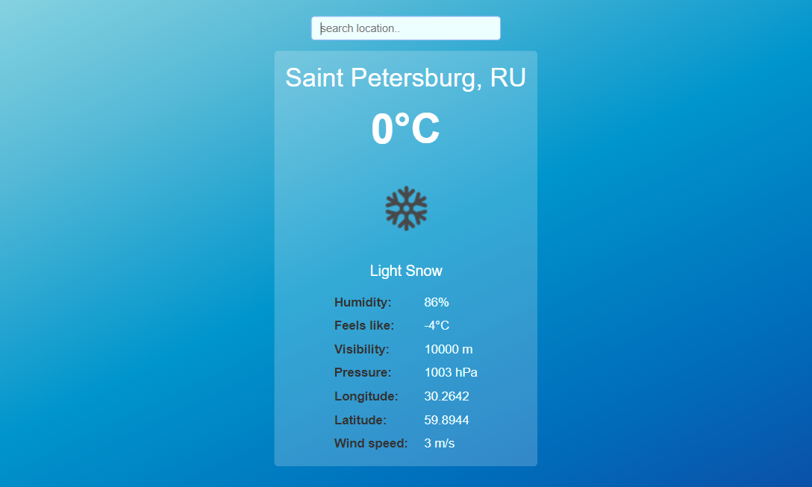

# Weather App (PWA) 🌦️

A Progressive Web App (PWA) for checking the weather, built using **React**, **TypeScript**, **CSS**, and **HTML**. The app fetches real-time weather data from the [OpenWeatherMap API](https://openweathermap.org/api) and provides a modern, responsive experience on desktop and mobile.

---

## 🚀 Visit Website

[**VISIT WEBSITE!**](https://openweatherapp-pwa.netlify.app)

---

## 🖼️ Screenshots





---

## Features

- Built with React for a fast, interactive UI
- Get current weather for any city using OpenWeatherMap API
- Responsive design for desktop and mobile
- Progressive Web App – installable and offline-ready
- Displays temperature, humidity, wind speed, pressure, location, and more
- Search by city name
- Geolocation support for local weather

---

## Technologies Used

- **React** (with TypeScript)
- CSS
- HTML
- OpenWeatherMap API

---

## Getting Started

1. **Clone the repository:**
   ```bash
   git clone https://github.com/adarSonmez/weather-app.git
   cd weather-app
   ```

2. **Install dependencies:**
   ```bash
   npm install
   ```

3. **Run the app locally:**
   ```bash
   npm start
   ```

4. **Open `http://localhost:3000` in your browser.**

---

## Author

Created by [adarSonmez](https://github.com/adarSonmez)
